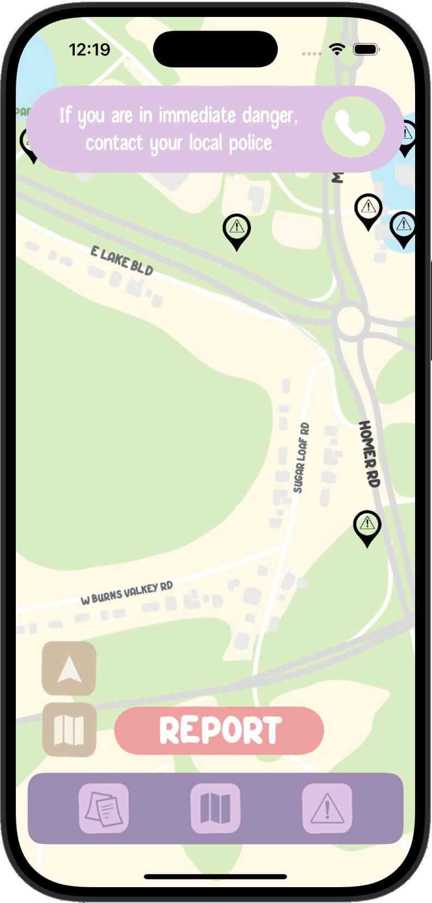
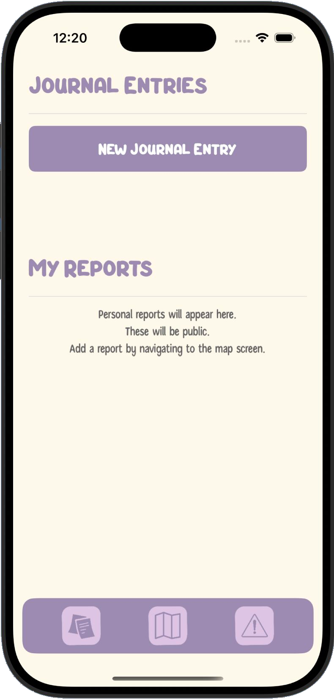

# Ella 💜
- I participated in and organizing the first ever University of New Orleans x Tulane University Hackathon! 
- With the theme being Social Innovation and Sustainability, My teammate and I wanted to focus on women’s issues. Only 5% of women who are sexually assaulted report their assault to the police. So we created Ella to combat that issue.

Ella a mobile app designed to connect victims together to promote safety and encourage users to go to the police with their reports. This prototype was created in React Native.

## Features:
📎 Anonymous reports (with optional police questions to prepare victims before making an official report)

📜 A private journal to document experiences

⏰ Emergency contact and check-in system
 
📞 National resource lines

# Screenshots: 

